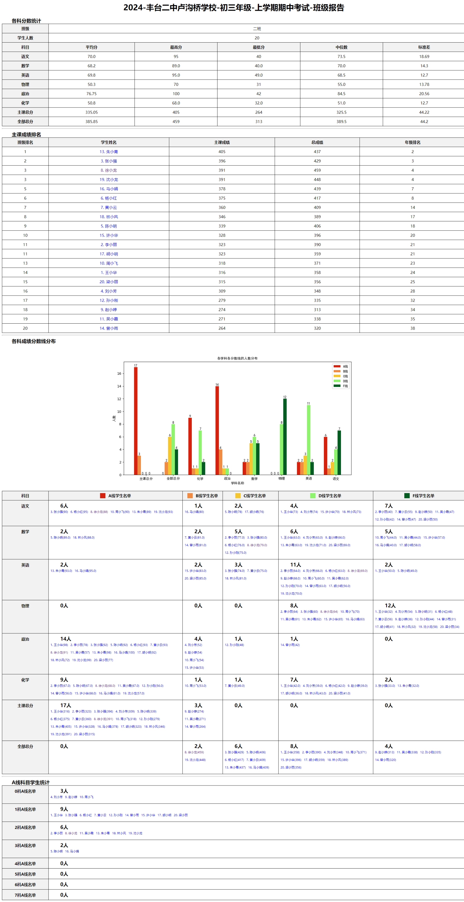

# pyscores

# 1. 功能
根据提供的班级学生成绩

- 输出每个学生的成绩及排名
- 输出班级的成绩分布

# 2. 使用说明

- 填写【学校】名称
- 选择【年级】
- 选择【考试】
- 【浏览】成绩文件（数据）
- 【浏览】选择结果文件的保存路径
- 选择【计算任务】
- 点击【开始生成】

# 3. 依赖

- numpy
- pandas
- pyinstaller
- matplotlib
- PySide6
- jinja2

# 4. 制作成EXE （Windows App)

~~~sh
# pyinstaller -F App.py --hidden-import PySide6.QtXml --icon="logo.png" --exclude-module PyQt5
pyinstaller -F App.py --noconsole --hidden-import PySide6.QtXml --icon="logo.png" --exclude-module PyQt5
xcopy /Y templates dist\templates
xcopy /Y /S data dist\data
xcopy /Y ui dist\ui
xcopy /Y /S config dist\config
copy .env dist\.env
# 支持中文的字体文件 
copy C:\Windows\Fonts\simhei.ttf dist\simhei.ttf
~~~

# 6. 结果文件截图

## - 学生成绩单

## - 班级成绩报告

