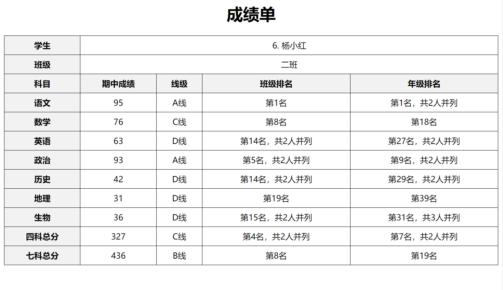
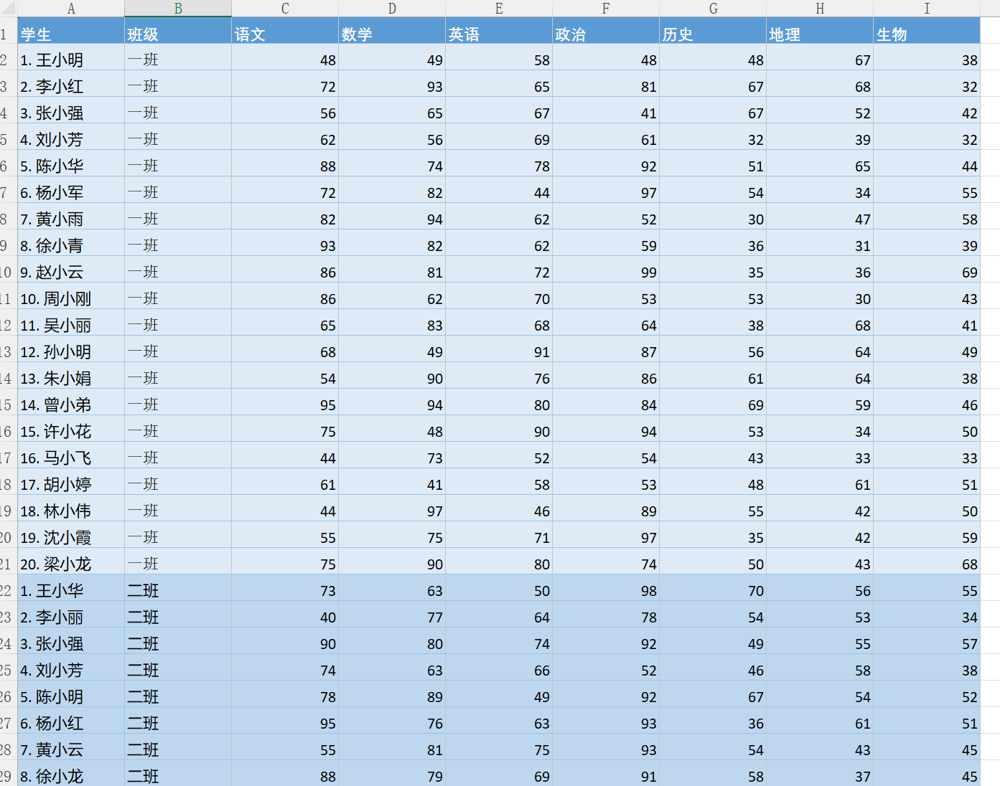
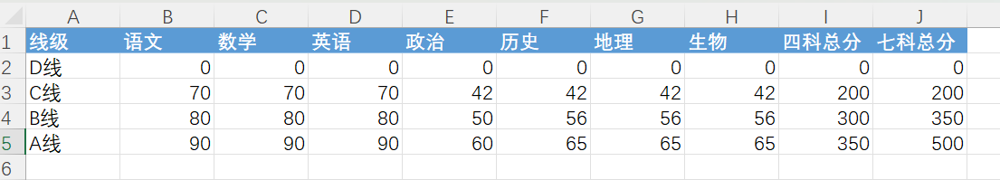

# PyScore使用说明

by 胡维正

# 1. 用途

帮助老师整理学生的考试成绩， 生成统一的成绩单。 如下图：

包括了各科成绩和总分成绩的班级排名、年级排名情况， 以及对应的A、B、C、D成绩级别。

# 2. 数据准备

需要准备两个Excel数据文件，和一个JSON配置文件， 都放在`<工作目录>/data/<年级>`路径下:

1. scores.xlsx    学生成绩数据
2. levels.xlsx    成绩线级定义
3. config.json    配置学生的课程

## 2.1 准备scores.csv 成绩数据

该文件提供了各个学生的各科考试成绩， 以下是示例：

## 2.2 准备levels.csv 线级定义

该文件定义了各科成绩及总分成绩的A、B、C、D级别，以下是示例，供参考

注意， 各线级从上到下**必须**是从小到大排列。

# 3. 使用方式

## 3.1 使用python运行

1. 安装python环境， 3.10版本以上

2. 安装必要的依赖

   ~~~sh
   pip install pandas
   pip install numpy
   ~~~

   

3. 运行程序

   将pyscores.zip解压在工作目录下，然后进入工作目录， 在命令行下运行：

   ~~~sh
   python pyscores.py
   ~~~

## 3.2 使用EXE 运行

​	在工作目录下， 运行：

       ~~~sh
       pyscores.exe
       ~~~

# 4. 输出

## 4.1 输出output/<年级>/scores.csv 计算文件

该文件计算了每名学生的各科排名及总分情况。

## 4.2 输出每名学生的成绩单

示例结果如下：

